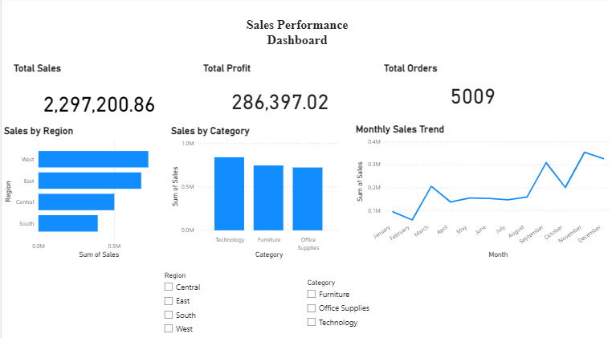

# Sales Data Analysis & Dashboard

## Project Overview

This project analyzes retail sales data using Python, Pandas, Matplotlib, and Power BI to uncover sales trends, regional performance, and product profitability insights.

The project includes:

* Data cleaning and preprocessing
* Exploratory Data Analysis (EDA)
* Business insights generation
* Interactive Power BI dashboard

---

## Tools & Technologies

* Python
* Pandas
* Matplotlib
* Google Colab
* Power BI
* Git & GitHub

---

## Dataset

Superstore retail sales dataset containing:

* Orders
* Products
* Sales
* Profit
* Regions
* Customer segments

---

## Key Analysis Performed

* Sales trend analysis
* Regional sales comparison
* Category and sub-category analysis
* Profitability analysis
* Discount vs profit relationship
* KPI generation

---

## Dashboard Features

* Total Sales KPI
* Total Profit KPI
* Total Orders KPI
* Sales by Region
* Sales by Category
* Monthly Sales Trend
* Interactive slicers for Region and Category

---

## Key Insights

* Technology category generated the highest sales and profit.
* West region had the strongest sales performance.
* Sales peaked during November and December.
* High discounts negatively impacted profitability.

---

## Dashboard Preview

---

## Project Structure

sales-data-analysis-project/
│
├── data/
├── dashboard/
├── notebooks/
├── dashboard_screenshot.png
└── README.md

---

## Author

Nadim
